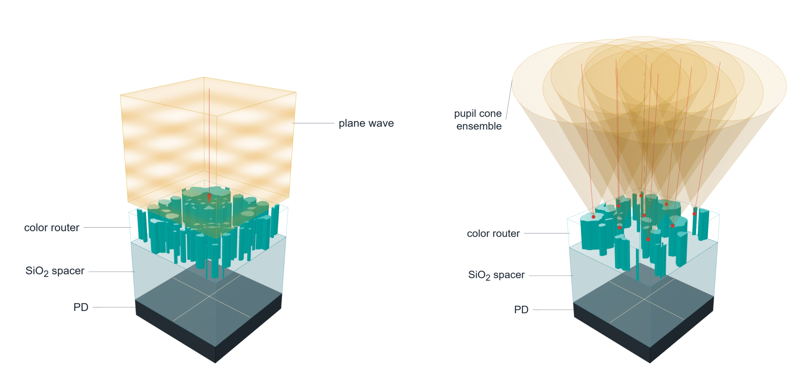
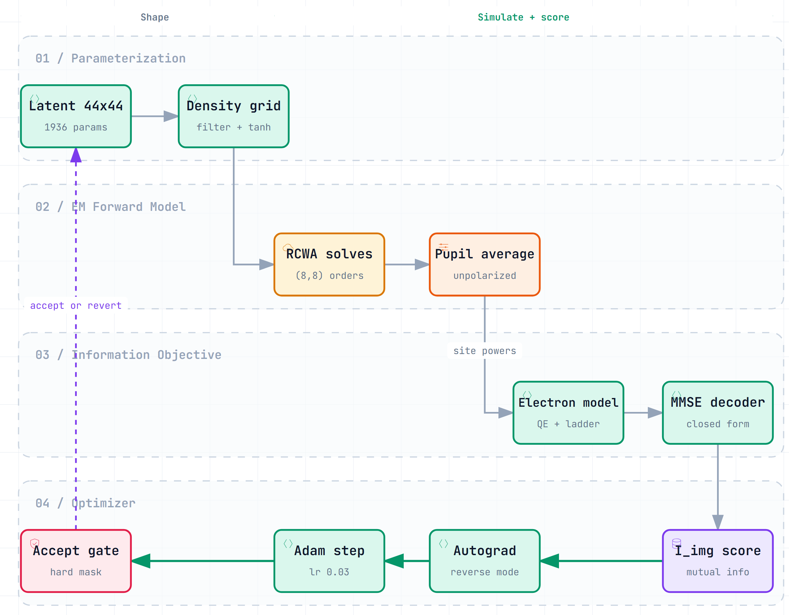

# Imaging-System-Aware Inverse Design of Information-Optimized Colour Routers



*The premise: under a camera, illumination is the finite-NA pupil cone of the
imaging lens (right), not a single plane wave (left).*

Reference implementation of the two core method components of the paper. The
first is the forward model: a colour router placed under a camera is not
illuminated by a single plane wave but by the finite-NA cone that the imaging
lens delivers to that field point, so the response is evaluated as an
incoherent, weighted ensemble of pupil directions whose chief ray tilts with
field position and whose total weight follows the relative illumination
`cos(CRA)^4`, with both source polarizations averaged and the four wells scored
from the exact S-matrix transmission. The second is the design objective:
instead of a hand-set spectral target, the router is scored by the imaging
information a measurement carries about the target colour signal, which for a
linear-Gaussian channel `Y = A X + N` with target `Z` has the closed form
`I_cell = 1/2 log2(det Sigma_Z / det Sigma_{Z|Y})`; the per-raw-pixel quantity
reported in the paper is `I_img = I_cell / 4` (the four-site cell spans four raw
pixels), and it is differentiable in the router geometry.



*One optimizer step. This repository implements stages 02 and 03 (the
pupil-ensemble forward model and the imaging-information objective); the
parameterization and optimizer stages are shown for context.*

## Install

```
pip install -e .
```

The imaging-information objective and the pupil ensemble need only `numpy` and
`torch`. The RCWA forward solve additionally needs `torcwa`:

```
pip install -e ".[rcwa]"
```

## Run the demo

```
python examples/demo.py
```

The demo builds a pupil quadrature and evaluates the imaging-information
objective on synthetic covariances. It is a reference demonstration on
synthetic inputs, not a reproduction of the paper's reported numbers, and it
runs on CPU without an RCWA solver.

## Scope

This repository is a reference implementation of the core method: the
finite-NA pupil-ensemble forward model and the imaging-information objective.
The deployed design masks and the derived response caches used for the figures
are included under `data/`. The full evaluation pipeline and the optimizer are
available from the corresponding author on reasonable request.

## Citation

```bibtex
@article{park_colour_router,
  title   = {Imaging-System-Aware Inverse Design of Information-Optimized Colour Routers},
  author  = {Park, Hyoseok and Park, Sehyeon and Lee, Myungjae and Park, Yeonsang},
  journal = {arXiv preprint},
  eprint  = {arXiv:2608.13019},
  year    = {2026}
}
```
